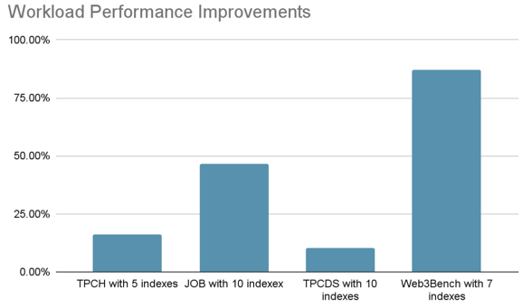
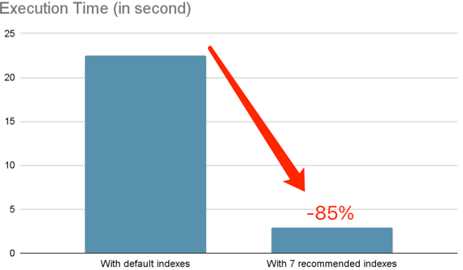
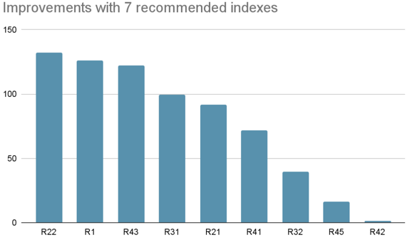
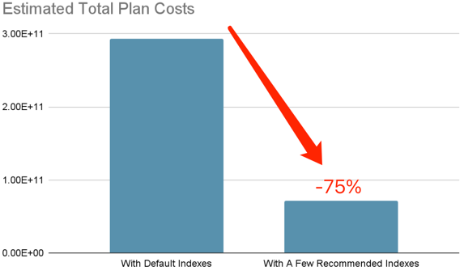
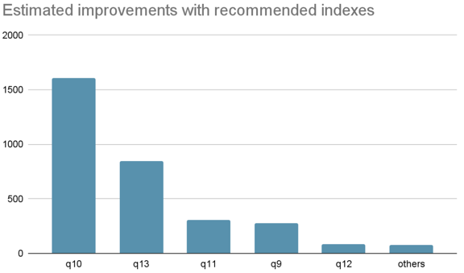

# TiDB Index Advisor (Beta)

## Introduction

Index selection is an important part of database performance tuning. However, it is a complex and time-consuming task.
Even experienced experts can hardly guarantee to find the best index scheme accurately and quickly when facing a complex
workload containing dozens or even hundreds of tables and thousands of SQLs.

TiDB Index Advisor (beta) is a command-line tool that can automatically recommend indexes based on the workload,
statistics, and execution plan
cost in TiDB, which can greatly reduce the workload of index maintenance in performance tuning.

## How it works

Index Advisor is based on the Hypo Index feature of TiDB. This feature allows users to create and maintain a series of
hypothetical indexes in the optimizer. These indexes are only maintained in the optimizer and will not be actually
created, so the overhead is very low. Combined with the `Explain` statement, you can evaluate the impact of an index on
the query plan, and then determine whether the index is valuable.


The working principle of Index Advisor is as follows, which can be roughly divided into three steps:

1. Index Advisor collects workload-related table structures, statistics, and related queries from the system tables of
   the TiDB instance.
2. Index Advisor generates a series of candidate indexes based on the collected information, and uses Hypo Index to
   create these indexes.
3. Index Advisor uses `Explain` to evaluate the value of these indexes (whether they can reduce some queries' plan
   costs) and make recommendations.

In our experiments, it can bring significant performance improvement on these workloads (see [Evaluation](#evaluation)):



## How to use it

TiDB Index Advisor provides two ways to use it, offline mode and online mode:

- In online mode, you don’t need to prepare any data. Index Advisor will directly access your TiDB instance for index
  analysis and recommendation. **During this period, it will read some system table information and create some Hypo
  Indexes, but it will not modify the data**.
- In offline mode, Index Advisor will not directly access your TiDB instance. It will start a TiDB instance locally,
  import the data you provide, and then perform index analysis and recommendation.

Generally speaking:

- Online mode is easier to use and more secure, since you don't have to export any data from you cluster;
- Offline mode is more flexible, but you need to prepare some data in advance.


### Installation

If you are going to use the offline-mode, you need to install [TiUP](https://docs.pingcap.com/tidb/dev/tiup-overview)
first. Please use the following command to install [TiUP](https://docs.pingcap.com/tidb/dev/tiup-overview):

```shell
curl --proto '=https' --tlsv1.2 -sSf https://tiup-mirrors.pingcap.com/install.sh | sh
```

Currently, to use this tool, you have to build it from the source code (we'll prepare a binary version soon):

```shell
# install golang on your machine first
> git clone https://github.com/qw4990/index_advisor.git
> cd index_advisor; go build;
```

### Online Mode

In online mode, Index Advisor will directly access your TiDB instance, so you need to ensure the following conditions:

- The TiDB version needs to be higher than v7.2, so that the `Hypo Index` feature can be used. (See workaround
  on [FAQs](#error-your-tidb-version-does-not-support-hypothetical-index-feature) if you are using a lower version of
  TiDB)
- Index Advisor will read the query information from `Statement Summary` (if the query file is not manually specified),
  so you need to ensure that the `Statement Summary` feature has been enabled and the `tidb_redact_log` feature has been
  disabled, otherwise the query cannot be obtained from it.

You can use `index_advisor precheck --dsn='root:@tcp(127.0.0.1:4000)'` to check whether your cluster can meet the above
conditions.

The following is an example of using online mode:

```
index_advisor advise-online --dsn='root:@tcp(127.0.0.1:4000)' \
--max-num-indexes=5 \
--output='./data/advise_output'
```

The meaning of each parameter is as follows:

- `dsn`: the DSN of the TiDB instance.
- `max-num-indexes`: the maximum number of recommended indexes, default `5`.
- `output`: the path to save the output result, optional; if it is empty, it will be printed directly on the terminal.

Below are some optional parameters to help you filter queries:

- `query-schemas`: the schema names of queries to be analyzed, separated by commas, optional, e.g. `db1,db2`.
- `query-exec-time-threshold`: the threshold of query execution time(in milliseconds), e.g. `300`, queries that are
  running longer than or equal to this threshold will be considered.
- `query-exec-count-threshold`: the threshold of query execution count, e.g. `20`, queries that are executed more than
  or equal to this threshold will be considered.
- `query-path`: use this parameter to specify queries manually, it's the path of the query file (optional, if it is
  specified, the advisor will not read queries from `Statement Summary`), which can be a single file (such
  as [`examples/tpch_example2/queries.sql`](examples/tpch_example2/queries.sql)) or a folder (such
  as [`examples/tpch_example1/queries`](examples/tpch_example1/queries)).

See more examples on [Usages](#usages).

### Offline Mode

Offline mode requires the following data:

- Query file (or folder): can be in the form of a single file or a folder.
    - Folder: such as [`examples/tpch_example1/queries`](examples/tpch_example1/queries), a folder, each file inside is
      a query.
    - Single file: such as [`examples/tpch_example2/queries.sql`](examples/tpch_example2/queries.sql), which contains
      multiple query statements separated by semicolons.
- Schema information file: such as [`examples/tpch_example1/schema.sql`](examples/tpch_example1/schema.sql), which
  contains the original `create-table` statement separated by semicolons.
- Statistics information folder: such as [`examples/tpch_example1/stats`](examples/tpch_example1/stats), a folder, which
  stores the statistics information files of related tables. Each statistics information file should be in JSON format
  and can be downloaded
  through [the TiDB statistics information dump](https://docs.pingcap.com/tidb/stable/statistics#export-statistics).

After preparing the above files, you can directly use Index Advisor for index recommendation, such as:

```shell
index_advisor advise-offline --tidb-version=v7.2.0 \
--query-path=examples/tpch_example1/queries \
--schema-path=examples/tpch_example1/schema.sql \
--stats-path=examples/tpch_example1/stats \
--max-num-indexes=5 \
--output='./data/advise_output'
```

The meaning of each parameter is as follows:

- `tidb-version`: the TiDB version used. Index Advisor will start an instance of this version of TiDB locally.
- `query-path`: the path of the query file, which can be a single file (such
  as [`examples/tpch_example2/queries.sql`](examples/tpch_example2/queries.sql)) or a folder (such
  as [`examples/tpch_example1/queries`](examples/tpch_example1/queries)).
- `schema-path`: the path of the schema information file (such
  as [`examples/tpch_example1/schema.sql`](examples/tpch_example1/schema.sql)).
- `stats-path`: the path of the statistics information folder (such
  as [`examples/tpch_example1/stats`](examples/tpch_example1/stats)).
- `max-num-indexes`: the maximum number of recommended indexes, default `5`.
- `output`: the path to save the output result, optional; if it is empty, it will be printed directly on the terminal.

To simplify, you can also put all required files on the same directory, and then just
use `--dir-path=examples/tpch_example1`.

### Output

The output of Index Advisor is a folder (such as [`examples/tpch_example1/output`](examples/tpch_example1/output)),
which contains the following files:

- `summary.txt`: the summary result, which contains recommended indexes and expected benefits.
- `ddl.sql`: DDL of all recommended indexes.
- `q*.txt`: expected benefit of each query in your workload, which contains the plan and plan cost before and after
  creating these recommended indexes.

Below is an example of [`examples/tpch_example1/output/summary.txt`](examples/tpch_example1/output/summary.txt):

```
Total Queries in the workload: 21
Total number of indexes: 5
  CREATE INDEX idx_l_partkey_l_quantity_l_shipmode ON tpch.lineitem (l_partkey, l_quantity, l_shipmode);
  CREATE INDEX idx_l_partkey_l_shipdate_l_shipmode ON tpch.lineitem (l_partkey, l_shipdate, l_shipmode);
  CREATE INDEX idx_l_suppkey_l_shipdate ON tpch.lineitem (l_suppkey, l_shipdate);
  CREATE INDEX idx_o_custkey_o_orderdate_o_totalprice ON tpch.orders (o_custkey, o_orderdate, o_totalprice);
  CREATE INDEX idx_ps_suppkey_ps_supplycost ON tpch.partsupp (ps_suppkey, ps_supplycost);
Total original workload cost: 1.37E+10
Total optimized workload cost: 1.02E+10
Total cost reduction ratio: 25.22%
Top 10 queries with the most cost reduction ratio:
  Alias: q22, Cost Reduction Ratio: 1.97E+08->4.30E+06(0.02)
  Alias: q19, Cost Reduction Ratio: 2.89E+08->1.20E+07(0.04)
  Alias: q20, Cost Reduction Ratio: 3.40E+08->4.39E+07(0.13)
...
```

Above is the summary of the recommendation, which contains the recommended indexes, the expected benefits to the entire
workload, and the expected benefits of the top 5 queries.

### Restrictions and Explanations

Some explanations:

- We'll integrate this tool into our cloud platform in the future to make it more convenient to use on cloud.
- This tool can work for both new systems (no indexes) and existing systems. For existing systems, it will not recommend
  indexes that already exist.
- Usually, this tool takes a few minutes to finish the recommendation.
- There is another alternative tool called [index-insight](https://docs.pingcap.com/tidbcloud/index-insight) that works
  as a diagnostic tool for index recommendation in TiDB Clinic, here are the differences:
    - [index-insight](https://docs.pingcap.com/tidbcloud/index-insight) is only for cloud, while this tool can work for
      both on-premise and cloud.
    - [index-insight](https://docs.pingcap.com/tidbcloud/index-insight) can only recommend indexes for a single query,
      while this tool can recommend indexes for a
      workload.
    - [index-insight](https://docs.pingcap.com/tidbcloud/index-insight) works as a diagnostic tool triggered by slow
      queries, while this is a physical database design tool.

Below are some restrictions:

- It cannot recommend primary keys.
- The maximum number of indexes to recommend at a time is `20`, and the maximum index width is `5`, otherwise it will take too long.
- If the target workload is too simple, it may not recommend the `max-num-indexes` indexes.
- Restrictions of Online Mode:
    - The TiDB Version must be equal or larger than `v7.2`. (see workaround
      on [FAQs](#error-your-tidb-version-does-not-support-hypothetical-index-feature)
    - The `tidb_redact_log` must be set to `false`.

## Evaluation

We use multiple workloads to evaluate the Index Advisor.

### TPC-H

We use TPC-H-1G to evalute it, which contains 8 tables, 21 queries (excluding q15), and let Index Advisor recommend 5
indexes for these queries:

```sql
CREATE INDEX idx_l_partkey_l_quantity_l_shipmode ON tpch.lineitem (l_partkey, l_quantity, l_shipmode);
CREATE INDEX idx_l_partkey_l_shipdate ON tpch.lineitem (l_partkey, l_shipdate);
CREATE INDEX idx_l_suppkey_l_shipdate ON tpch.lineitem (l_suppkey, l_shipdate);
CREATE INDEX idx_o_custkey_o_orderdate_o_totalprice ON tpch.orders (o_custkey, o_orderdate, o_totalprice);
CREATE INDEX idx_ps_suppkey_ps_supplycost ON tpch.partsupp (ps_suppkey, ps_supplycost);
```

After creating these indexes, the execution time of all queries is reduced from `17.143s` to `14.373s`, and the
execution time is reduced by `-16%`:


The following are several queries with significant improvement:


In `q19`, after creating these indexes, it can avoid the full table scan of the large table `lineitem`, and reduce the
execution time from `557ms` to `8.75ms`.

### JOB

We use JOB to evaluate it, which contains x tables, x queries, and let Index Advisor recommend 10 indexes for these
queries:

```sql
CREATE INDEX idx_movie_id_person_id ON imdbload.cast_info (movie_id, person_id);
CREATE INDEX idx_person_id ON imdbload.cast_info (person_id);
CREATE INDEX idx_role_id ON imdbload.cast_info (role_id);
CREATE INDEX idx_company_type_id ON imdbload.movie_companies (company_type_id);
CREATE INDEX idx_movie_id_company_id_company_type_id ON imdbload.movie_companies (movie_id, company_id, company_type_id);
CREATE INDEX idx_info_type_id ON imdbload.movie_info (info_type_id);
CREATE INDEX idx_movie_id_info_type_id ON imdbload.movie_info (movie_id, info_type_id);
CREATE INDEX idx_movie_id_info_type_id ON imdbload.movie_info_idx (movie_id, info_type_id);
CREATE INDEX idx_keyword_id_movie_id ON imdbload.movie_keyword (keyword_id, movie_id);
CREATE INDEX idx_movie_id_keyword_id ON imdbload.movie_keyword (movie_id, keyword_id);
```

After creating these indexes, the execution time of all queries is reduced from `225s` to `120s`, and the execution time
is reduced by `-46%`:


The following are several queries with significant improvement:


In some queries, through using `IndexJoin` to access the large table `cast_info` and `movie_info`, the execution time is
obviously reduced.

### TPC-DS

In TPC-DS 1G test, we use 61 queries (excluding queries that TiDB does not support well), and let Index Advisor
recommend 10 indexes:

```sql
CREATE INDEX idx_cs_call_center_sk ON tpcds.catalog_sales (cs_call_center_sk);
CREATE INDEX idx_cs_sold_date_sk ON tpcds.catalog_sales (cs_sold_date_sk);
CREATE INDEX idx_ca_city ON tpcds.customer_address (ca_city);
CREATE INDEX idx_ca_state_ca_country_ca_city ON tpcds.customer_address (ca_state, ca_country, ca_city);
CREATE INDEX idx_d_year_d_moy_d_qoy ON tpcds.date_dim (d_year, d_moy, d_qoy);
CREATE INDEX idx_i_category_i_brand_i_class ON tpcds.item (i_category, i_brand, i_class);
CREATE INDEX idx_ss_sold_date_sk_ss_net_profit ON tpcds.store_sales (ss_sold_date_sk, ss_net_profit);
CREATE INDEX idx_ss_sold_time_sk ON tpcds.store_sales (ss_sold_time_sk);
CREATE INDEX idx_t_hour ON tpcds.time_dim (t_hour);
CREATE INDEX idx_ws_sold_date_sk_ws_net_profit ON tpcds.web_sales (ws_sold_date_sk, ws_net_profit)
```

After creating these indexes, the execution time is reduced by `-10%`:


Below are several queries with significant improvement:


### Web3Bench

The advisor recommends 7 indexes for this workload:

```sql
CREATE INDEX idx_block_number ON ethereum.receipts (block_number);
CREATE INDEX idx_from_address_block_number_token_address ON ethereum.token_transfers (from_address, block_number, token_address);
CREATE INDEX idx_token_address ON ethereum.token_transfers (token_address);
CREATE INDEX idx_block_number ON ethereum.transactions (block_number);
CREATE INDEX idx_from_address ON ethereum.transactions (from_address);
CREATE INDEX idx_hash ON ethereum.transactions (hash);
CREATE INDEX idx_to_address_block_timestamp_value ON ethereum.transactions (to_address, block_timestamp, `value`);
```

After creating these indexes, the total workload execution time is reduced by `-85%`:



Below are several queries with significant improvement:



### A Web3 Customer Workload

After creating a few recommended indexes, the total workload plan cost is reduced by `-75%`:



Below are several queries with significant improvement:



## Usages

### Specify query file manually on online-mode

```bash
index_advisor advise-online --dsn='root:@tcp(127.0.0.1:4000)\
--max-num-indexes=5 \
--query-path=examples/tpch_example1/queries \
--output='./data/advise_output'
```

### Use query filter parameters on online-mode

In the example below, only consider queries that run more than 1 second on `DB1`:

```bash
index_advisor advise-online --dsn='root:@tcp(127.0.0.1:4000)\
--max-num-indexes=5 \
--query-schemas='DB1' \
--query-exec-time-threshold=1000 \
--output='./data/advise_output'
```

## FAQs

### Error `your TiDB version does not support hypothetical index feature`

This error occurs when the TiDB version is too low, and the hypothetical index feature is not supported. Please make
sure your TiDB version is large or equal to `v7.2`.

A workaround is to use offline-mode with the latest version of TiDB(`-tidb-version='nightly'`), the result is also of
high reference value.

### Error `table 'db.t' doesn't exist` on offline-mode

This error is usually caused by the lack of database name in `schema-path`, you can manually add `Use DB`
and `Create DB` statements in the schema file:

```sql
CREATE
DATABASE tpch;
USE
tpch;
CREATE TABLE `customer`
(
    ...
);
...
```

## Future Plans

- Support index deletion recommendation
- Integrate this tool with `TiUP` and `TiDB Cloud`