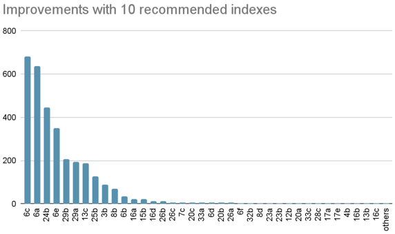
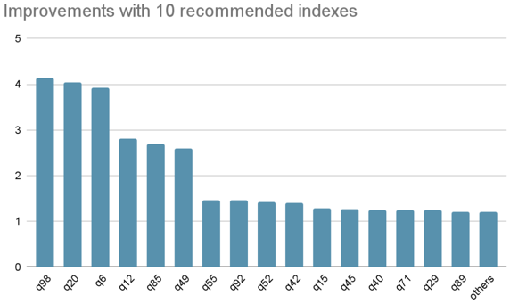

# Index Advisor

## Introcution

Index selection is an important part of database performance tuning. However, it is a complex and time-consuming task. Even experienced experts can hardly guarantee to find the best index scheme accurately and quickly when facing a complex workload containing dozens or even hundreds of tables and thousands of SQLs.

Index Advisor is a tool that can automatically recommend indexes based on the workload, statistics, and execution plan cost in TiDB, which can greatly reduce the workload of index maintenance in performance tuning.

## How it works

Index Advisor is based on the Hypo Index feature of TiDB. This feature allows users to create and maintain a series of hypothetical indexes in the optimizer. These indexes are only maintained in the optimizer and will not be actually created, so the overhead is very low. Combined with the `Explain` statement, you can evaluate the impact of an index on the query plan, and then determine whether the index is valuable.


```
mysql> create table t (a int);
mysql> explain format='verbose' select * from t where a=1;
+-------------------------+----------+------------+-----------+---------------+--------------------------------+
| id                      | estRows  | estCost    | task      | access object | operator info                  |
+-------------------------+----------+------------+-----------+---------------+--------------------------------+
| TableReader_7           | 10.00    | 168975.57  | root      |               | data:Selection_6               |
| └─Selection_6           | 10.00    | 2534000.00 | cop[tikv] |               | eq(test.t.a, 1)                |
|   └─TableFullScan_5     | 10000.00 | 2035000.00 | cop[tikv] | table:t       | keep order:false, stats:pseudo |
+-------------------------+----------+------------+-----------+---------------+--------------------------------+

mysql> create index idx_a type hypo on t (a); -- add a hypo index and see the cost change
mysql> explain format='verbose' select * from t where a=1;
+------------------------+---------+---------+-----------+-------------------------+---------------------------------------------+
| id                     | estRows | estCost | task      | access object           | operator info                               |
+------------------------+---------+---------+-----------+-------------------------+---------------------------------------------+
| IndexReader_6          | 10.00   | 150.77  | root      |                         | index:IndexRangeScan_5                      |
| └─IndexRangeScan_5     | 10.00   | 1628.00 | cop[tikv] | table:t, index:idx_a(a) | range:[1,1], keep order:false, stats:pseudo |
+------------------------+---------+---------+-----------+-------------------------+---------------------------------------------+
```

The working principle of Index Advisor is as follows, which can be roughly divided into three steps:

1. Index Advisor collects workload-related table structures, statistics, and related queries from the system tables of the TiDB instance.
2. Index Advisor generates a series of candidate indexes based on the collected information, and uses Hypo Index to create these indexes.
3. Index Advisor uses `Explain` to evaluate the value of these indexes (whether they can reduce some queries' plan costs) and make recommendations.

## How to use it

Index Advisor provides two ways to use it, which is convenient for offline mode and online mode:

- In online mode, you don’t need to prepare any data. Index Advisor will directly access your TiDB instance for index analysis and recommendation. During this period, it will read some system table information and create some Hypo Indexes, but it will not modify the data.
- In offline mode, Index Advisor will not directly access your TiDB instance. It will start a TiDB instance locally, import the data you provide, and then perform index analysis and recommendation.

Generally speaking, online mode is easier to use, but it will directly access your TiDB instance; offline mode is more flexible, but you need to prepare some data in advance.


### Offline Mode

Offline mode requires the following data:

- Query file (or folder): can be in the form of a single file or a folder.
  - Folder: such as `examples/tpch_example1/queries`, a folder, each file inside is a query.
  - Single file: such as `examples/tpch_example2/queries.sql`, which contains multiple query statements separated by semicolons.
- Schema information file: such as `examples/tpch_example1/schema.sql`, which contains the original `create-table` statement separated by semicolons.
- Statistics information folder: such as `examples/tpch_example1/stats`, a folder, which stores the statistics information files of related tables. Each statistics information file should be in JSON format and can be downloaded through the TiDB statistics information dump.

After preparing the above files, you can directly use Index Advisor for index recommendation, such as:

```shell
index_advisor advise-offline --tidb-version=v7.2.0\
--query-path=examples/tpch_example1/queries \
--schema-path=examples/tpch_example1/schema.sql \
--stats-path=examples/tpch_example1/stats \
--max-num-indexes=5 \
--output='./data/advise_output'
```

The meaning of each parameter is as follows:

- `tidb-version`: the TiDB version used. Index Advisor will start an instance of this version of TiDB locally.
- `query-path`: the path of the query file, which can be a single file (such as `examples/tpch_example2/queries.sql`) or a folder (such as `examples/tpch_example1/queries`).
- `schema-path`: the path of the schema information file (such as `examples/tpch_example1/schema.sql`).
- `stats-path`: the path of the statistics information folder (such as `examples/tpch_example1/stats`).
- `max-num-indexes`: the maximum number of recommended indexes.
- `output`: the path to save the output result, optional; if it is empty, it will be printed directly on the terminal.

### Online Mode

In online mode, Index Advisor will directly access your TiDB instance, so you need to ensure the following conditions:

- The TiDB version needs to be higher than v7.2, so that the `Hypo Index` feature can be used.
- Index Advisor will read the query information from `Statement Summary` (if the query file is not manually specified), so you need to ensure that the `Statement Summary` feature has been enabled and the `tidb_redact_log` feature has been disabled, otherwise the query cannot be obtained from it.

The following is an example of using online mode:

```
index_advisor advise-online --dsn='root:@tcp(127.0.0.1:4000)\
--max-num-indexes=5 \
--output='./data/advise_output'
```

The meaning of each parameter is as follows:

- `dsn`: the DSN of the TiDB instance.
- `query-path`: the path of the query file (optional, if it is specified, the advisor will not read queries from `Statement Summary`), which can be a single file (such as `examples/tpch_example2/queries.sql`) or a folder (such as `examples/tpch_example1/queries`).
- `max-num-indexes`: the maximum number of recommended indexes.
- `output`: the path to save the output result, optional; if it is empty, it will be printed directly on the terminal.

### Output

The output of Index Advisor is a folder (such as `examples/tpch_example1/output`), which contains the following files:

- `summary.txt`: the summary result, which contains recommended indexes and expected benefits.
- `ddl.sql`: DDL of all recommended indexes.
- `q*.txt`: expected benefit of each query in your workload, which contains the plan and plan cost before and after creating these recommended indexes.

Below is an example of `examples/tpch_example1/output/summary.txt`:

```
Total Queries in the workload: 21
Total number of indexes: 5
  CREATE INDEX idx_l_partkey_l_quantity_l_shipmode ON tpch.lineitem (l_partkey, l_quantity, l_shipmode);
  CREATE INDEX idx_l_partkey_l_shipdate_l_shipmode ON tpch.lineitem (l_partkey, l_shipdate, l_shipmode);
  CREATE INDEX idx_l_suppkey_l_shipdate ON tpch.lineitem (l_suppkey, l_shipdate);
  CREATE INDEX idx_o_custkey_o_orderdate_o_totalprice ON tpch.orders (o_custkey, o_orderdate, o_totalprice);
  CREATE INDEX idx_ps_suppkey_ps_supplycost ON tpch.partsupp (ps_suppkey, ps_supplycost);
Total original workload cost: 1.37E+10
Total optimized workload cost: 1.02E+10
Total cost reduction ratio: 25.22%
Top 10 queries with the most cost reduction ratio:
  Alias: q22, Cost Reduction Ratio: 1.97E+08->4.30E+06(0.02)
  Alias: q19, Cost Reduction Ratio: 2.89E+08->1.20E+07(0.04)
  Alias: q20, Cost Reduction Ratio: 3.40E+08->4.39E+07(0.13)
  Alias: q17, Cost Reduction Ratio: 8.36E+08->2.00E+08(0.24)
  Alias: q2, Cost Reduction Ratio: 1.35E+08->3.76E+07(0.28)
  Alias: q5, Cost Reduction Ratio: 7.79E+08->2.51E+08(0.32)
  Alias: q11, Cost Reduction Ratio: 7.62E+07->2.54E+07(0.33)
  Alias: q7, Cost Reduction Ratio: 5.99E+08->2.46E+08(0.41)
  Alias: q14, Cost Reduction Ratio: 2.76E+08->1.17E+08(0.43)
  Alias: q21, Cost Reduction Ratio: 8.62E+08->4.30E+08(0.50)
...
```

Above is the summary of the recommendation, which contains the recommended indexes, the expected benefits to the entire workload, and the expected benefits of the top 5 queries.

## Evaluation

We use multiple workloads to evaluate the Index Advisor.

### TPC-H

We use TPC-H-1G to evalute it, which contains 8 tables, 21 queries (excluding q15), and let Index Advisor recommend 5 indexes for these queries:

```sql
CREATE INDEX idx_l_partkey_l_quantity_l_shipmode ON tpch.lineitem (l_partkey, l_quantity, l_shipmode);
CREATE INDEX idx_l_partkey_l_shipdate ON tpch.lineitem (l_partkey, l_shipdate);
CREATE INDEX idx_l_suppkey_l_shipdate ON tpch.lineitem (l_suppkey, l_shipdate);
CREATE INDEX idx_o_custkey_o_orderdate_o_totalprice ON tpch.orders (o_custkey, o_orderdate, o_totalprice);
CREATE INDEX idx_ps_suppkey_ps_supplycost ON tpch.partsupp (ps_suppkey, ps_supplycost);
```

After creating these indexes, the execution time of all queries is reduced from `17.143s` to `14.373s`, and the execution time is reduced by `-16%`:


The following are several queries with significant improvement:


In `q19`, after creating these indexes, it can avoid the full table scan of the large table `lineitem`, and reduce the execution time from `557ms` to `8.75ms`.

### JOB

We use JOB to evaluate it, which contains x tables, x queries, and let Index Advisor recommend 10 indexes for these queries:

```sql
CREATE INDEX idx_movie_id_person_id ON imdbload.cast_info (movie_id, person_id);
CREATE INDEX idx_person_id ON imdbload.cast_info (person_id);
CREATE INDEX idx_role_id ON imdbload.cast_info (role_id);
CREATE INDEX idx_company_type_id ON imdbload.movie_companies (company_type_id);
CREATE INDEX idx_movie_id_company_id_company_type_id ON imdbload.movie_companies (movie_id, company_id, company_type_id);
CREATE INDEX idx_info_type_id ON imdbload.movie_info (info_type_id);
CREATE INDEX idx_movie_id_info_type_id ON imdbload.movie_info (movie_id, info_type_id);
CREATE INDEX idx_movie_id_info_type_id ON imdbload.movie_info_idx (movie_id, info_type_id);
CREATE INDEX idx_keyword_id_movie_id ON imdbload.movie_keyword (keyword_id, movie_id);
CREATE INDEX idx_movie_id_keyword_id ON imdbload.movie_keyword (movie_id, keyword_id);
```

After creating these indexes, the execution time of all queries is reduced from `225s` to `120s`, and the execution time is reduced by `-46%`:


The following are several queries with significant improvement:



In some queries, through using `IndexJoin` to access the large table `cast_info` and `movie_info`, the execution time is obviously reduced.

### TPC-DS

In TPC-DS 1G test, we use 61 queries (excluding queries that TiDB does not support well), and let Index Advisor recommend 10 indexes:

```sql
CREATE INDEX idx_cs_call_center_sk ON tpcds.catalog_sales (cs_call_center_sk);
CREATE INDEX idx_cs_sold_date_sk ON tpcds.catalog_sales (cs_sold_date_sk);
CREATE INDEX idx_ca_city ON tpcds.customer_address (ca_city);
CREATE INDEX idx_ca_state_ca_country_ca_city ON tpcds.customer_address (ca_state, ca_country, ca_city);
CREATE INDEX idx_d_year_d_moy_d_qoy ON tpcds.date_dim (d_year, d_moy, d_qoy);
CREATE INDEX idx_i_category_i_brand_i_class ON tpcds.item (i_category, i_brand, i_class);
CREATE INDEX idx_ss_sold_date_sk_ss_net_profit ON tpcds.store_sales (ss_sold_date_sk, ss_net_profit);
CREATE INDEX idx_ss_sold_time_sk ON tpcds.store_sales (ss_sold_time_sk);
CREATE INDEX idx_t_hour ON tpcds.time_dim (t_hour);
CREATE INDEX idx_ws_sold_date_sk_ws_net_profit ON tpcds.web_sales (ws_sold_date_sk, ws_net_profit)
```

After creating these indexes, the execution time is reduced by `-10%`:


Below are several queries with significant improvement:



### Web3Bench(TODO)

## F&Q

### Error `your TiDB version does not support hypothetical index feature`

This error occurs when the TiDB version is too low, and the hypothetical index feature is not supported. Please make sure your TiDB version is large or equal to `v7.2`.

A workaround is to use offline-mode with the latest version of TiDB(`-tidb-version='nightly'`), the result is also of high reference value.

### Error `table 'db.t' doesn't exist` on offline-mode

This error is usually caused by the lack of database name in `schema-path`, you can manually add `Use DB` and `Create DB` statements in the schema file:

```sql
CREATE DATABASE tpch;
USE tpch;
CREATE TABLE `customer` (...);
...
```