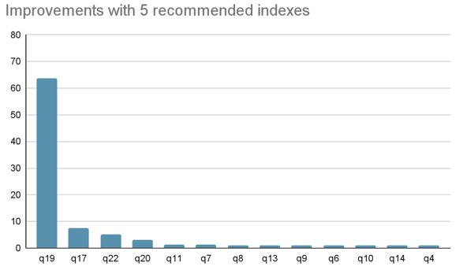

# Index Advisor 索引推荐

## 介绍

索引的选择是数据库性能调优工作中的重要一环，然而这也是一项复杂费时的工作，即使是富有经验的专家，在面对包含几十甚至上百张表、上千条 SQLs 的复杂工作负载时，也难以保证能准确快速的找到最佳索引方案。

Index Advisor 则是一款能根据 TiDB 中的工作负载、统计信息、执行计划代价等来自动推荐索引的工具，能极大的减少性能调优中索引维护的工作量。

## 原理

Index Advisor 基于 TiDB 的 Hypo Index 功能实现，此功能允许用户在优化器内创建维护一系列假设索引，这些索引仅仅维护在优化器内部，不会被实际创建，开销很低。再配合 `Explain` 语句，则可以评估某个索引对查询计划的影响，从而判断该索引是否有价值。

Index Advisor 的工作原理如下图，大致可以分为三步：


1. Index Advisor 会从 TiDB 实例的系统表中搜集工作负载相关的表结构、统计信息、相关查询等信息。
2. Index Advisor 根据搜集到的信息，生成一些列候选的索引，并使用 Hypo Index 创建这些索引。
3. Index Advisor 使用 `Explain` 评估这些索引的价值，并进行推荐。

## 使用

使用上我们提供了两种方式，在线模式和离线模式：
1. 在线模式下 Index Advisor 会直接访问你的 TiDB 实例，然后进行索引分析和推荐。
2. 离线模式下 Index Advisor 不会访问 TiDB 实例，需要手动将 Index Advisor 需要的信息准备好，Index Advisor 会在本地拉起一个 TiDB 实例，然后进行索引分析和推荐。

在线模式更加方便易用，离线模式更加灵活。

### 离线模式使用

离线模式要将 Index Advisor 需要的数据提前准备好，需要的数据包括：

- 查询文件（或文件夹）：可以以单个文件的方式，也可以以文件夹的形式。
  - 文件夹方式：如 `examples/tpch_example1/queries`，一个文件夹，内部每个文件为一条查询。
  - 单个文件方式：如 `examples/tpch_example2/queries.sql`，里面包含多条查询语句，用分号隔开。
- schema 信息文件（可选）：如 `examples/tpch_example1/schema.sql`，里面包含 `create-table` 语句原文，用分号隔开。
- 统计信息文件夹（可选）：如 `examples/tpch_example1/stats`，一个文件夹，内部存放相关表的统计信息文件，每个统计信息文件应该为 JSON 格式，可以通过 TiDB 统计信息 dump 下载。

准备好上述文件后，则直接使用 Index Advisor 进行索引推荐，如 `index_advisor --offline --query-path=examples/tpch_example1/queries --max-num-indexes=5`，其中参数的含义为：
- `offline`：表示使用离线模式。
- `query-path`：查询文件的路径，可以是单个文件，也可以是文件夹。
- `schema-path`：schema 信息文件的路径，可选；如果指定则会使用此文件创建表。
- `stats-path`：统计信息文件夹的路径，可选；如果指定则会导入文件夹内的统计信息。
- `max-num-indexes`：最多推荐的索引数量。
- `cost-model-version`：TiDB 使用的代价模型版本，见 [TiDB 代价模型版本](https://docs.pingcap.com/zh/tidb/dev/system-variables#tidb_cost_model_version-%E4%BB%8E-v620-%E7%89%88%E6%9C%AC%E5%BC%80%E5%A7%8B%E5%BC%95%E5%85%A5)。
- `output`：输出结果的保存路径，可选；如果为空则直接打印在终端上。

### 在线模式使用

- 请确保你的 TiDB 小版本高于 v6.5.x 或 v7.1.x，或大版本高于 v7.2，以使用 Hypo Index 的功能。 
- 请确保你的 TiDB 上默认打开了 `Statement Summary` 功能，Index Advisor 需要从此系统表获取负载的查询信息。
- 需要关闭 `tidb_redact_log` 功能，否则 Index Advisor 无法从 `Statement Summary` 中拿到查询原文。
- 使用 Index Advisor 进行索引推荐，如 `index_advisor --online --dsn='user1:@tcp(127.0.0.1:4000)' --max-num-indexes=5 --query-exec-time-threshold=300ms`，其中参数的含义为：
   - `online`：表示使用在线模式。
   - `dsn`：访问你 TiDB 实例的 DSN。
   - `max-num-indexes`：最多推荐的索引数量。
   - `query-exec-time-threshold`：只对执行时间超过此阈值的查询进行索引推荐。
- Index Advisor 会输出推荐的索引，以及对应查询的受益，你可以根据输出结果创建新的索引。

### 输出说明

输出的结果会包含推荐索引的 DDL 语句，以及相关的信息，如下所示：

```
============== Recommended Indexes ==============
CREATE INDEX t_uid_oid ON t (uid, oid);
...

============== Benefit Evaluation ==============
Total query plan cost: 100000 -> 30000, improvement: 70.00%
Q1 plan cost: 1000 -> 100, improvement: 90.00%
Q2 plan cost: 1000 -> 100, improvement: 90.00%
...
```

## 评估

在内部我们用了多个数据集来进行评估。

### TPC-H

我们使用 TPC-H 1G 来进行测试，其包含 8 张表，21 个查询（不包含 q15），让 Index Advisor 为这些查询推荐 5 个索引。

创建索引后，全部查询的执行时间从 32.86s 下降为了 26.61s，执行时间降低接近 20%：


下面是几个提升比较显著的查询：



### JOB

TODO

### TPC-DS

TODO

### TODO

## 用例

TODO