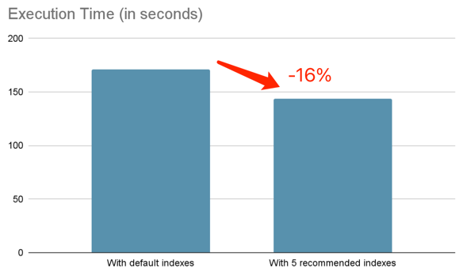
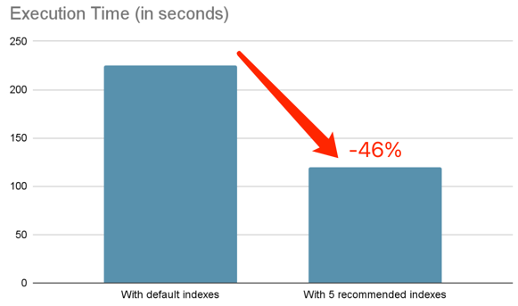

# Index Advisor 索引推荐

## 介绍

索引的选择是数据库性能调优工作中的重要一环，然而这也是一项复杂费时的工作，即使是富有经验的专家，在面对包含几十甚至上百张表、上千条 SQLs 的复杂工作负载时，也难以保证能准确快速的找到最佳索引方案。

Index Advisor 则是一款能根据 TiDB 中的工作负载、统计信息、执行计划代价等来自动推荐索引的工具，能极大的减少性能调优中索引维护的工作量。

## 原理

Index Advisor 基于 TiDB 的 Hypo Index 功能实现，此功能允许用户在优化器内创建维护一系列假设索引，这些索引仅仅维护在优化器内部，不会被实际创建，开销很低。再配合 `Explain` 语句，则可以评估某个索引对查询计划的影响，从而判断该索引是否有价值。

Index Advisor 的工作原理如下图，大致可以分为三步：


1. Index Advisor 会从 TiDB 实例的系统表中搜集工作负载相关的表结构、统计信息、相关查询等信息。
2. Index Advisor 根据搜集到的信息，生成一些列候选的索引，并使用 Hypo Index 创建这些索引。
3. Index Advisor 使用 `Explain` 评估这些索引的价值（这些索引能否降低某些查询的执行计划代价），并进行推荐。

## 使用

Index Advisor 提供两种使用方式，方便为离线模式和在线模式：

- 在线模式几乎不用你准备任何数据，Index Advisor 会直接访问你的 TiDB 实例进行索引分析和推荐，期间会读取一些系统表信息、创建一些 Hypo Index，但不会对数据有修改。
- 离线模式 Index Advisor 不会直接访问你的 TiDB 实例，它会在本地启动一个 TiDB 实例，导入你提供的数据，然后进行索引分析和推荐。

在线模式使用上更加简单，但是会直接访问你的 TiDB 实例；离线模式则更加灵活，但是需要你提前准备好一些数据。

### Offline Mode

离线模式需要数据包括：

- 查询文件（或文件夹）：可以以单个文件的方式，也可以以文件夹的形式。
  - 文件夹方式：如 `examples/tpch_example1/queries`，一个文件夹，内部每个文件为一条查询。
  - 单个文件方式：如 `examples/tpch_example2/queries.sql`，里面包含多条查询语句，用分号隔开。
- schema 信息文件：如 `examples/tpch_example1/schema.sql`，里面包含 `create-table` 语句原文，用分号隔开。
- 统计信息文件夹：如 `examples/tpch_example1/stats`，一个文件夹，内部存放相关表的统计信息文件，每个统计信息文件应该为 JSON 格式，可以通过 TiDB 统计信息 dump 下载。

准备好上述文件后，则直接使用 Index Advisor 进行索引推荐，如：

```shell
index_advisor advise-offline --tidb-version=v7.2.0\
--query-path=examples/tpch_example1/queries \
--schema-path=examples/tpch_example1/schema.sql \
--stats-path=examples/tpch_example1/stats \
--max-num-indexes=5 \
--output='./data/advise_output'
```

下面是各个参数的含义：

- `tidb-version`：使用的 TiDB 版本，Index Advisor 会在本地启动这个版本的 TiDB 实例。
- `query-path`：查询文件的路径，可以是单个文件（如 `examples/tpch_example2/queries.sql`），也可以是文件夹（如 `examples/tpch_example1/queries`）。
- `schema-path`：schema 信息文件的路径（如 `examples/tpch_example1/schema.sql`）。
- `stats-path`：统计信息文件夹的路径（如 `examples/tpch_example1/stats`）。
- `max-num-indexes`：最多推荐的索引数量。
- `output`：输出结果的保存路径，可选；如果为空则直接打印在终端上。

### Online Mode

在线模式会直接访问你的 TiDB 实例，需要确保以下条件：

- TiDB 版本需要高于 v6.5.x 或者 v7.1.x 或者 v7.2，才能使用 `Hypo Index` 功能。
- Index Advisor 会从 `Statement Summary` 读取查询信息（如果不手动指定查询文件），需要确保 `Statement Summary` 功能已经开启并关闭 `tidb_redact_log` 功能，否则无法从中获取到查询原文。

下面是在线模式的使用示例：

```
index_advisor advise-online --dsn='root:@tcp(127.0.0.1:4000)\
--max-num-indexes=5 \
--output='./data/advise_output'
```

下面是各个参数的含义：

- `dsn`：连接到 TiDB 实例的 DSN。
- `query-path`：查询文件的路径，可选，如果指定则不会总 `Statement Summary` 再读取查询了。
- `max-num-indexes`：最多推荐的索引数量。
- `output`：输出结果的保存路径，可选；如果为空则直接打印在终端上。

### 输出说明

输出的文件夹中包含下面这些文件（如 `examples/tpch_example1/output`)：

- `summary.txt`：推荐的索引信息，以及预期的收益。
- `ddl.sql`：推荐的索引的 DDL 语句。
- `q*.txt`：每个查询添加索引前后的执行计划情况，及对应的代价。

下面是 `examples/tpch_example1/output/summary.txt` 的实例：

```
Total Queries in the workload: 21
Total number of indexes: 5
  CREATE INDEX idx_l_partkey_l_quantity_l_shipmode ON tpch.lineitem (l_partkey, l_quantity, l_shipmode);
  CREATE INDEX idx_l_partkey_l_shipdate ON tpch.lineitem (l_partkey, l_shipdate);
  CREATE INDEX idx_l_suppkey_l_shipdate ON tpch.lineitem (l_suppkey, l_shipdate);
  CREATE INDEX idx_o_custkey_o_orderdate_o_totalprice ON tpch.orders (o_custkey, o_orderdate, o_totalprice);
  CREATE INDEX idx_ps_suppkey_ps_supplycost ON tpch.partsupp (ps_suppkey, ps_supplycost);
Total original workload cost: 1.37E+10
Total optimized workload cost: 1.02E+10
Total cost reduction ratio: 25.22%
Top 5 queries with the most cost reduction:
  Alias: q22, Cost Reduction Ratio: 1.97E+08->4.30E+06(0.02)
  Alias: q19, Cost Reduction Ratio: 2.89E+08->1.20E+07(0.04)
  Alias: q20, Cost Reduction Ratio: 3.40E+08->4.39E+07(0.13)
  Alias: q17, Cost Reduction Ratio: 8.36E+08->2.00E+08(0.24)
  Alias: q2, Cost Reduction Ratio: 1.35E+08->3.76E+07(0.28)
```

上面包含了推荐的索引信息，预期对整个工作负载的收益，优化前后的总代价，以及收益最高的几个查询收益情况。

## 评估

在内部我们用了多个数据集来进行评估。

### TPC-H

我们使用 TPC-H 1G 来进行测试，其包含 8 张表，21 个查询（不包含 q15），让 Index Advisor 为这些查询推荐 5 个索引：

```sql
CREATE INDEX idx_l_partkey_l_quantity_l_shipmode ON tpch.lineitem (l_partkey, l_quantity, l_shipmode);
CREATE INDEX idx_l_partkey_l_shipdate ON tpch.lineitem (l_partkey, l_shipdate);
CREATE INDEX idx_l_suppkey_l_shipdate ON tpch.lineitem (l_suppkey, l_shipdate);
CREATE INDEX idx_o_custkey_o_orderdate_o_totalprice ON tpch.orders (o_custkey, o_orderdate, o_totalprice);
CREATE INDEX idx_ps_suppkey_ps_supplycost ON tpch.partsupp (ps_suppkey, ps_supplycost);
```

创建索引后，全部查询的执行时间从 17.143s 下降为了 14.373s，执行时间降低 -16%：



下面是几个提升比较显著的查询：


在 q19 中，通过创建索引，避免了对大表 `lineitem` 的全表扫描，将 q19 的执行时间从 `557ms` 缩短为了 `8.75ms`。

### JOB

在 JOB 的测试中，共包含 x 张表，x 个查询，让 Index Advisor 推荐了 10 个索引：

```sql
CREATE INDEX idx_movie_id_person_id ON imdbload.cast_info (movie_id, person_id);
CREATE INDEX idx_person_id ON imdbload.cast_info (person_id);
CREATE INDEX idx_role_id ON imdbload.cast_info (role_id);
CREATE INDEX idx_company_type_id ON imdbload.movie_companies (company_type_id);
CREATE INDEX idx_movie_id_company_id_company_type_id ON imdbload.movie_companies (movie_id, company_id, company_type_id);
CREATE INDEX idx_info_type_id ON imdbload.movie_info (info_type_id);
CREATE INDEX idx_movie_id_info_type_id ON imdbload.movie_info (movie_id, info_type_id);
CREATE INDEX idx_movie_id_info_type_id ON imdbload.movie_info_idx (movie_id, info_type_id);
CREATE INDEX idx_keyword_id_movie_id ON imdbload.movie_keyword (keyword_id, movie_id);
CREATE INDEX idx_movie_id_keyword_id ON imdbload.movie_keyword (movie_id, keyword_id);
```

创建索引后，整体执行时间从 `225s` 下降到 `120s`，降低了 46%：



下面是几个提升比较显著的查询：


在多个查询中，通过索引使用 `IndexJoin` 对大表 `cast_info` 和 `movie_info` 进行访问，避免了全表扫描，执行时间有了显著的降低。

### TPC-DS

TODO

### TODO

## 用例

TODO